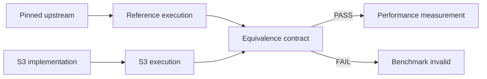

# S3 Language External Benchmarks

Public, reproducible benchmark and correctness harness for workloads implemented with the **S3 programming language**.

This repository is intentionally separate from the main S3 compiler repository so benchmark methodology, reference pins and result contracts can be inspected independently.

> **CORRECTNESS BEFORE PERFORMANCE.** A timing result is invalid unless the S3 implementation and the reference implementation satisfy the campaign's explicit observable-equivalence contract.

## Why this repository exists

Compiler benchmarks are easy to overstate. S3-Benchmarks uses a stricter model:

1. pin an external reference workload;
2. define the observable behavior that must match;
3. verify equivalence first;
4. only then collect performance measurements;
5. keep candidate workloads separate from executable benchmark claims.



## Executable workload

### [`benchmarks/jsmn`](benchmarks/jsmn/README.md)

Compares the upstream C implementation of `zserge/jsmn` with an S3 behavioral port kernel under a differential correctness contract.

## Candidate corpus

The post-M1.80 program tracks pinned external references for future campaigns:

- [`references/upstreams-m171-m180.json`](references/upstreams-m171-m180.json) — immutable upstream pins and milestone mapping;
- [`references/README.md`](references/README.md) — promotion policy for external workloads;
- [`candidates/m171-m180`](candidates/m171-m180/README.md) — bounded campaign candidates.

Current references include:

- Rust;
- Tokio;
- Mio;
- rustls;
- libuv;
- LLVM;
- Cargo;
- uv.

MoneyPrinterTurbo is tracked only as a possible real-world workload shape. It is **not** treated as a compiler oracle and is not vendored as an executable benchmark claim.

## Running the suite

```bash
# Differential correctness only
python tools/runner.py --verify-only

# Short benchmark smoke
python tools/runner.py --smoke

# Full statistical run
python tools/runner.py --full
```

At present these commands execute the **JSMN campaign**. Candidate campaigns are not benchmark results until they have their own correctness and structural-equivalence harnesses.

## Result validity

A result should be treated as valid only when all applicable checks pass:

- pinned reference identity;
- deterministic input corpus;
- semantic/observable equivalence;
- expected checksum/output;
- campaign-specific structural checks;
- successful benchmark harness completion.

A faster run with different observable behavior is a **failed compiler/workload comparison**, not a performance win.

## CI

`.github/workflows/tests.yml` executes verification for the currently supported executable suite on pushes and pull requests.

## Relationship to S3

The main S3 compiler project explores typed IR, verification, SSA/CFG, optimization, S3 Assembly and native Linux x86-64 generation.

This repository does not duplicate the compiler. Its role is to provide **external, auditable evidence** for workload correctness and performance characterization as S3 evolves.
